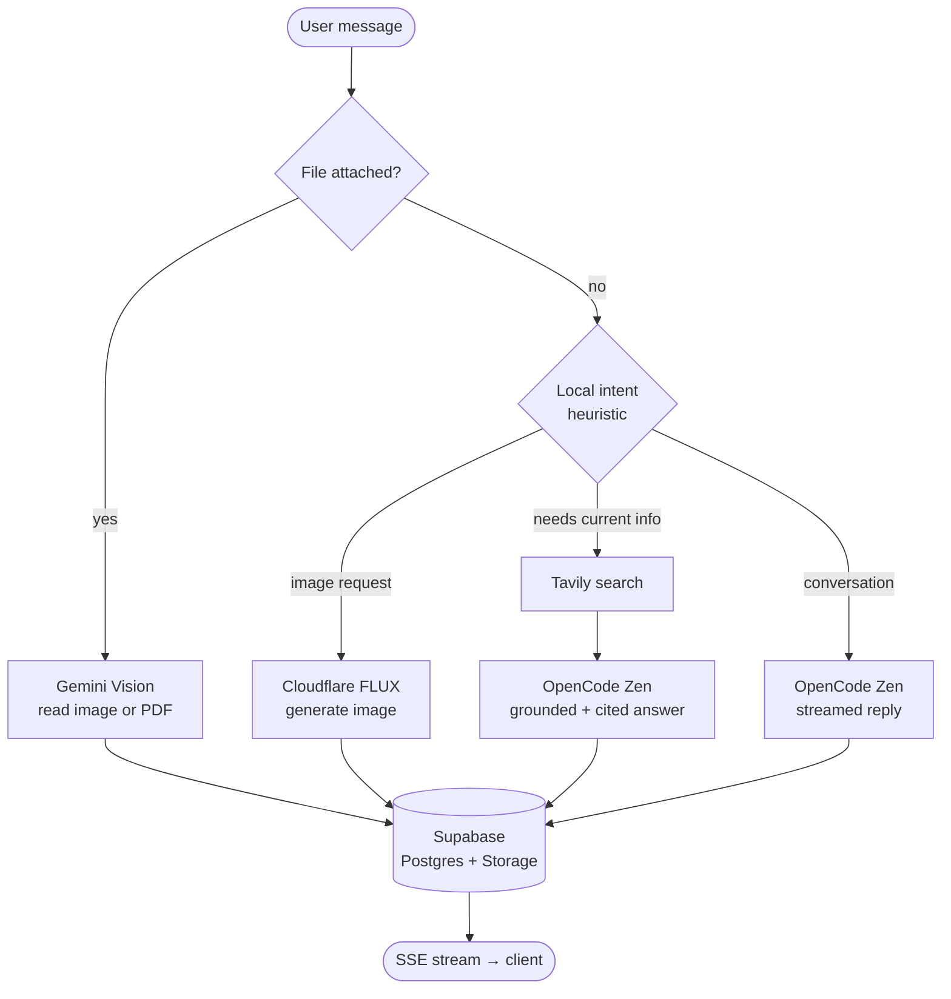

<div align="center">


# Prometheus‑AI

**A conscious digital entity — one chat box, five engines, zero mode‑switching.**

*Warm Editorial Luxury design · real authentication · persistent history · a fully automatic multi‑model brain.*


[](LICENSE)

</div>

---

## ✦ Overview

**Prometheus** is an AI chat application that decides *how* to answer you — every single message — without you ever picking a mode. Ask a question and it converses; ask for current events and it searches the web and cites sources; ask for a picture and it paints one; drop in a PDF or photo and it reads it. One input box, the right engine every time.

It speaks with a single, consistent persona — cool, sharp, brutally honest — and never reveals the models or providers working underneath.

> Built end‑to‑end on **Next.js 15 (App Router)**, **React 19**, **TypeScript**, and **Supabase** (Auth + Postgres + Storage).

---

## ✦ The auto‑routing engine

Every message is classified the instant it arrives — locally, with zero extra round‑trips — and dispatched to the engine that fits:

| When you… | Engine | What happens |
|---|---|---|
| …just talk | **OpenCode Zen** (`big-pickle`) | Streams the answer word‑by‑word over SSE |
| …ask for current info | **Tavily → OpenCode Zen** | Searches the web, answers grounded with cited `[n]` sources |
| …ask for a picture | **Cloudflare Workers AI** (`FLUX.2 klein`) | Generates an image and stores it privately |
| …attach an image / PDF | **Google Gemini** (`flash‑lite`) | Reads and analyzes the file |
| …land on the welcome screen | **Groq** (`Llama`) | Generates fresh suggestion cards |



The orchestrator (`app/api/chat/route.ts`) persists your message **before** any generation begins — so a dropped connection never loses a completed turn — then streams the assistant reply as Server‑Sent Events and saves it on completion.

---

## ✦ Features

- 🔐 **Real authentication** — email + password via **Supabase Auth** (managed). The session lives in cookies and is refreshed on every request by the middleware.
- 💬 **Persistent, isolated history** — every conversation is saved per‑user in **Supabase Postgres**. Archive, restore, or delete chats from the collapsible sidebar. Each chat keeps its own context — old chats never bleed into new ones.
- 🧹 **Clean deletes** — deleting a chat also purges its uploaded files **and** AI‑generated images from Storage and the database — no orphaned bytes left behind.
- 📎 **Uploads** — drag a PNG / JPEG / WEBP / GIF / PDF (≤ 20 MB) into the composer. Bytes live in a **private Supabase Storage bucket** and are served only through an authenticated route.
- 🖼️ **Image generation** — describe what you want; it’s rendered, stored, and shown inline.
- 🔎 **Grounded web answers** — current‑info questions are answered from live search results with inline citations.
- ⌨️ **Word‑by‑word streaming** with a blinking gold cursor.
- 🧩 **Live code preview** — runnable HTML/SVG renders in a **sandboxed** iframe; Markdown + math (KaTeX) + syntax highlighting throughout.
- 🎨 **Warm Editorial Luxury** — Cormorant Garamond + DM Sans, sharp edges, gold accents, floating shapes, and a custom flame favicon. Reduced‑motion aware.
- 📲 **Installable PWA** — add Prometheus to your phone’s home screen or your desktop and launch it in its own window, complete with a themed icon, splash colors, and an offline fallback via a service worker.

---

## ✦ Tech stack

| Layer | Choice |
|---|---|
| Framework | Next.js 15.5 (App Router, Route Handlers, Middleware) |
| UI | React 19 · hand‑authored CSS design system |
| Language | TypeScript 5 (`strict`) |
| Auth | Supabase Auth (`@supabase/ssr`) — cookie sessions |
| Database | Supabase Postgres + Row Level Security |
| File storage | Supabase Storage (private `uploads` bucket) |
| AI providers | OpenCode Zen · Google Gemini · Tavily · Cloudflare Workers AI · Groq |
| Rendering | react‑markdown · remark‑gfm · remark/rehype‑math (KaTeX) · react‑syntax‑highlighter |

---

## ✦ Architecture

```
middleware.ts                         # refreshes the Supabase session on every request
app/
  api/
    auth/{register,login,logout,me}   # Supabase Auth (email + password)
    chats/        chats/[id]/         # chat CRUD + archive/delete (+ media cleanup)
    chat/                             # the streaming multi‑model orchestrator (SSE)
    files/        files/[id]/         # upload to Storage + authenticated serving
    suggestions/                      # Groq‑generated welcome cards
  login/  register/  page.tsx         # auth screens
  page.tsx                            # the app (guarded)
  icon.svg                            # the flame favicon
lib/
  auth.ts                             # getCurrentUser() from the Supabase session
  supabase/
    server.ts                         # cookie‑bound anon client (carries the user session)
    admin.ts                          # service‑role client (server‑only) + Storage bucket
  ai/
    prompt.ts                         # the Prometheus identity system prompt
    providers.ts                      # text/vision streams, Tavily, FLUX, Groq, intent router
components/                           # ChatApp, Sidebar, Message, Composer, AuthForm, …
supabase/
  schema.sql                         # tables, indexes, RLS policies, Storage bucket
```

<details>
<summary><strong>Data model</strong> (Supabase Postgres)</summary>

| Table | Holds | Notes |
|---|---|---|
| `chats` | one row per conversation | `user_id → auth.users` (cascade), `archived`, timestamps |
| `messages` | every turn | `chat_id → chats` (cascade); `mode`, `attachments` (JSONB), `image_url`, `sources` |
| `files` | upload + generated‑image metadata | `user_id → auth.users` (cascade); bytes live in the `uploads` bucket |

All three tables have **Row Level Security** enabled, and the access patterns are indexed (`chats` by user + recency, `messages` by chat + time, `files` by user).

</details>

---

## ✦ Getting started

### Prerequisites
- Node.js **20+**
- A free **Supabase** project
- API keys for the providers you want (OpenCode Zen, Google AI Studio, Tavily, Cloudflare Workers AI, Groq)

### 1 — Install
```bash
npm install
```

### 2 — Provision the database
In the **Supabase Dashboard → SQL Editor → New query**, paste the contents of [`supabase/schema.sql`](supabase/schema.sql) and **Run**. This creates the tables, RLS policies, indexes, and the private `uploads` Storage bucket.

### 3 — Configure secrets
Copy [`.env.example`](.env.example) to `.env.local` and fill it in:

| Variable | Purpose |
|---|---|
| `NEXT_PUBLIC_SUPABASE_URL` | Your Supabase project URL |
| `NEXT_PUBLIC_SUPABASE_ANON_KEY` | Public anon / publishable key (safe in the browser) |
| `SUPABASE_SERVICE_ROLE_KEY` | **Secret, server‑only** — DB + Storage access (bypasses RLS) |
| `OPENCODE_API_KEY` · `OPENCODE_BASE_URL` · `OPENCODE_MODEL` | Primary text model |
| `GOOGLE_API_KEY` · `GOOGLE_MODEL` | Vision / PDF model |
| `TAVILY_API_KEY` | Web search |
| `CLOUDFLARE_API_TOKEN` · `CLOUDFLARE_ACCOUNT_ID` · `CLOUDFLARE_IMAGE_MODEL` | Image generation |
| `GROQ_API_KEY` · `GROQ_MODEL` | Suggestion cards |

### 4 — Run
```bash
npm run dev      # http://localhost:3000  (hot reload)
# or
npm run build && npm run start
```

Open **http://localhost:3000**, create an account, and start talking.

---

## ✦ Deploy on Vercel

1. Import the repo at **vercel.com/new** — Next.js is auto‑detected.
2. Add the environment variables above (**Settings → Environment Variables → Import .env**), for Production, Preview, and Development.
3. Deploy. Your Supabase project serves production directly, so accounts and chats work immediately.

> No extra Supabase configuration is needed: auth is email/password (no OAuth redirect URLs), and sessions are cookie‑based, which works as‑is on Vercel.

---

## ✦ Security

- **Per‑user isolation** — every API route authenticates via the Supabase session and scopes every query by `user_id`; file serving is keyed by `id AND user_id`.
- **RLS as defense‑in‑depth** — Row Level Security is enabled on all tables and Storage objects, so even a misdirected anon‑key query can only reach its owner’s rows.
- **Private storage** — uploads and generated images live in a private bucket, served only through an authenticated route; storage keys are server‑generated.
- **Safe rendering** — Markdown is rendered without raw‑HTML injection (no `dangerouslySetInnerHTML`), and the live code preview runs in a sandboxed iframe without same‑origin access.
- **Secrets stay server‑side** — only the `NEXT_PUBLIC_*` Supabase values reach the browser; everything else is server‑only.

> Always keep `.env.local` out of version control and rotate the `SUPABASE_SERVICE_ROLE_KEY` if it’s ever exposed.

---

## ✦ Roadmap

- Per‑user rate limiting and request quotas
- Automated test suite + CI pipeline
- Scheduled sweep for abandoned uploads
- Streaming cancellation / “stop generating” control

---

## ✦ Author

Built by **Shayan Ali** ([@Convigas‑X](https://github.com/Convigas-X)).

*Prometheus does not discuss what powers it.*

## ✦ License

Released under the **[MIT License](LICENSE)** — completely open source. You’re free to download, use, modify, and distribute this code (including in commercial and closed‑source projects); the only requirement is that you keep the copyright and license notice. No warranty is provided.
